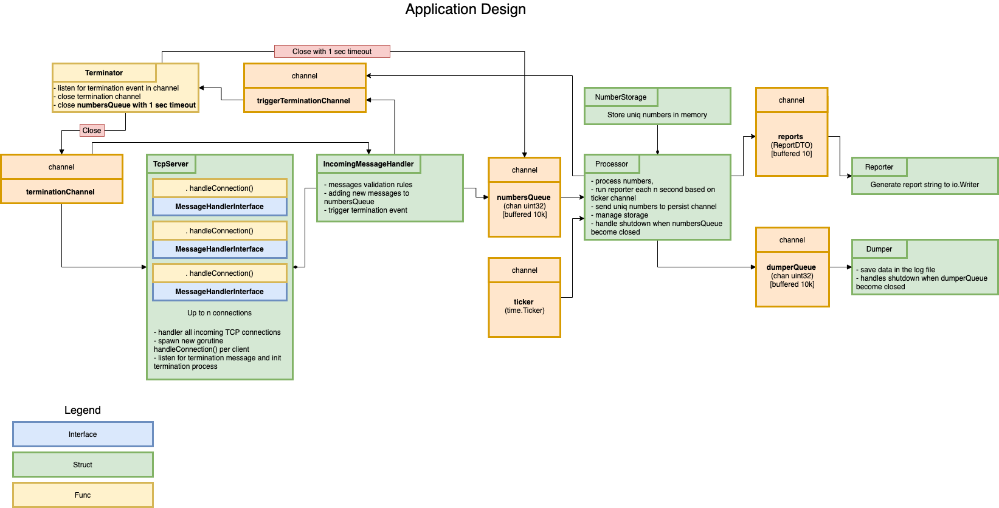

# Number server

This is an application that opens a socket and restricts input to at most 5 concurrent clients. Clients will connect to the Application and write any number of 9 digit numbers, and then close the connection. The Application must write a de-duplicated list of these numbers to a log file in no particular order.

## Tester
[Tester](client)
: TCP client that sends valid and invalid messages to this server

## Prepare (build)
clone this project to folder number-server into your $GOPATH and build
1. `git clone git@github.com:brushknight/number-server.git ~/go/src/number-server`
2. `cd ./number-server`
3. `go get ./...`
4. `make compile_server`

## Tests
1. `go test ./...`

## Run
1. `./number_server` 

### Additional flags
`-h` - HELP for flags

`-max-clients` - maximum of concurrent clients (default 5)

`-reporter-timeout` - frequency of report in seconds (default 10)

`-interface` - an interface to startup (default 0.0.0.0:4000)

`-log-file` - path to a log file (default ./numbers.log)

`-env` - an environment (default prd, allowed prd, dev)

`-leading-zeros` - enabling leading zeros in the log file (default true)

### Flag usage

`./number_server -max-clients=3` - will set max concurrent clients to 3

## Application design

